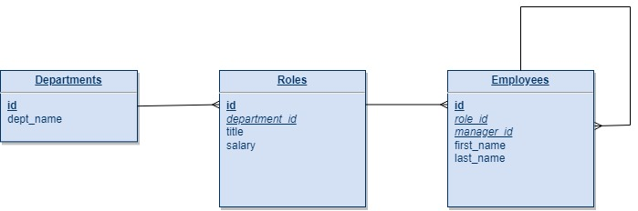

# Employee Tracker

## Description
This is a content management system console application to interact with information stored in a database by giving functionality to view and manage departments, roles and employees in a company. The technologies used for this application are Node.js, Inquirer and MySQL. 

## Database Design
> Relationship Diagram


Delete constraint: When a role is deleted, role_id is set to null on employees 

Delete constraint: When a manager is deleted, manager_id is set to null on employees

Delete constraint: When a department is deleted, department_id is set to null on roles

## Installation 
This application used mySql server to store data. If you haven't got MySQL installed, here is a [MySQl installation guide](https://coding-boot-camp.github.io/full-stack/mysql/mysql-installation-guide)

> Clone the app
```
> git clone (clone_addess) 
```
> Initialise and installing necessary npm packages and dependencies
```
> npm install
```
> Fill the .env_template file and rename it to .env
```
DB_HOST=[hostname]
DB_PORT=[port]
DB_USER=[user]
DB_PWD=[password]
```
> Login MySQL
```
> mysql -u root -p
mysql> password: [enter your password]
```
> Build the application database: 
```
mysql> source db/schema.sql
```
> If you wish to seed the database
```
mysql> source seeds.sql
```

## Usage
> To start the app, run the following command in the command line
```
> node app.js
```
[Here is a short demo video of how to install and use the application](https://youtu.be/AOMMEk4pLDs)

